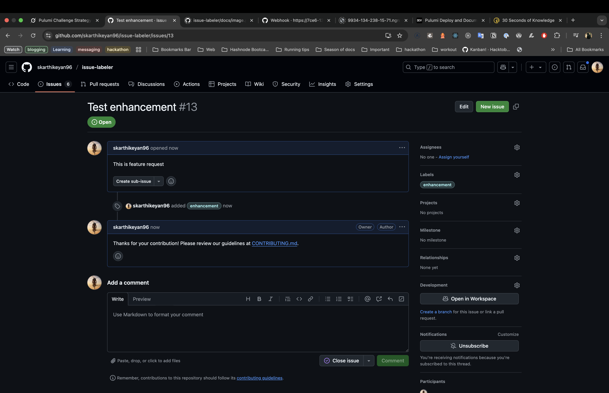

# GitHub Issue Auto-Labeler

## Overview

A Pulumi-based tool to automatically label GitHub issues based on keywords in titles and bodies, using a configurable `config.json` file. This project enhances repository management with automated comments and stale issue handling.

## Features

- Real-time labeling via GitHub webhooks.
- Labels based on issue title or body content.
- Customizable rules via `config.json`.
- Automated comments to remind contributors of guidelines (new).
- Auto-closes stale issues after 30 days of inactivity (new).

## Installation

### Prerequisites

- Node.js (v16+)
- Pulumi CLI
- GitHub account with a Personal Access Token (repo scope)

### Steps

1. Clone the repo: `git clone https://github.com/skarthikeyan96/issue-labeler.git`
2. Navigate to the folder: `cd issue-labeler`
3. Install dependencies: `yarn install`
4. Create a `.env` file with:
   GITHUB_TOKEN=your-github-token
   WEBHOOK_SECRET=my-secret-token
5. Set up labels with Pulumi: `pulumi up`

## Usage

1. Start the server: `yarn build && yarn start`
2. Expose locally with `ngrok http 3000` (install ngrok if needed).
3. Add a webhook in GitHub:

- URL: `https://<ngrok-url>/webhook`
- Content type: `application/json`
- Secret: `my-secret-token` (optional, for security)

4. Create an issue with a keyword (e.g., "bug") to test labeling and comments.

## Screenshots

## Troubleshooting

- **404 Error**: Verify `ngrok` URL and webhook path.
- **401 Error**: Ensure `WEBHOOK_SECRET` matches GitHub settings.
- **Label Missing**: Add new labels via Pulumi or GitHub UI.
- **No Comments**: Check `CONTRIBUTING.md` link and webhook setup.

## Contributing

See [CONTRIBUTING.md](CONTRIBUTING.md) for guidelines.
