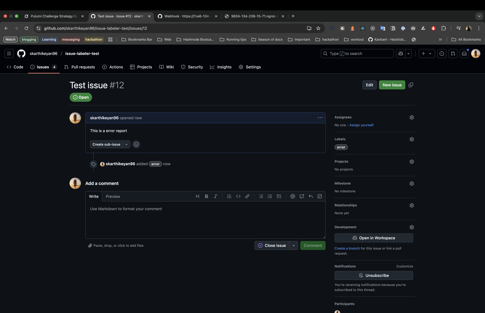

# Architecture

## Flow

1. GitHub sends a POST request to `/webhook` via `ngrok`.
2. Express server parses the JSON payload.
3. Octokit API applies the label based on `config.json` rules.

## API Docs

- **Endpoint**: `/webhook`
- **Method**: POST
- **Headers**: `X-GitHub-Event`, `Content-Type: application/json`
- **Body**: `{ action: "opened", issue: { title, body, number } }`

